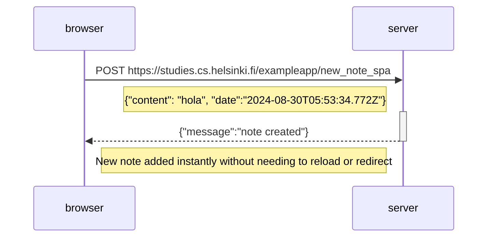

```mermaid
sequenceDiagram
participant browser
participant server

    browser->>server: POST https://studies.cs.helsinki.fi/exampleapp/new_note_spa
    Note left of server: {"content": "hola", "date":"2024-08-30T05:53:34.772Z"}
    activate server
    server-->>browser: {"message":"note created"}
    deactivate server
    Note right of browser: New note added instantly without needing to reload or redirect
```
